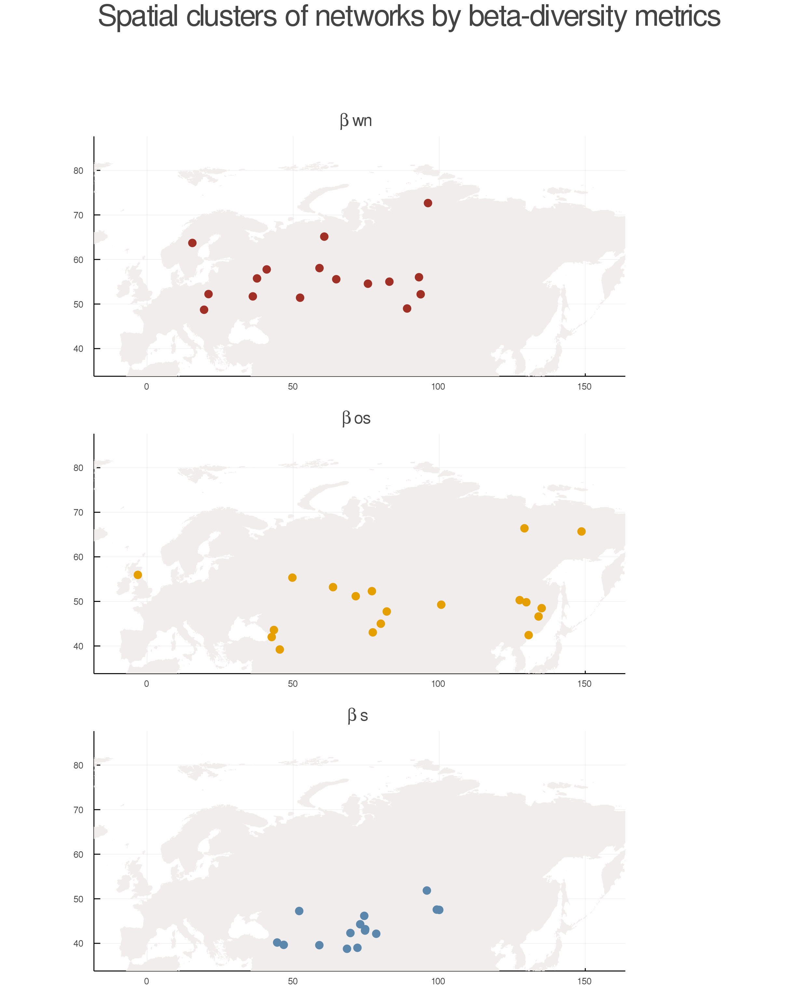
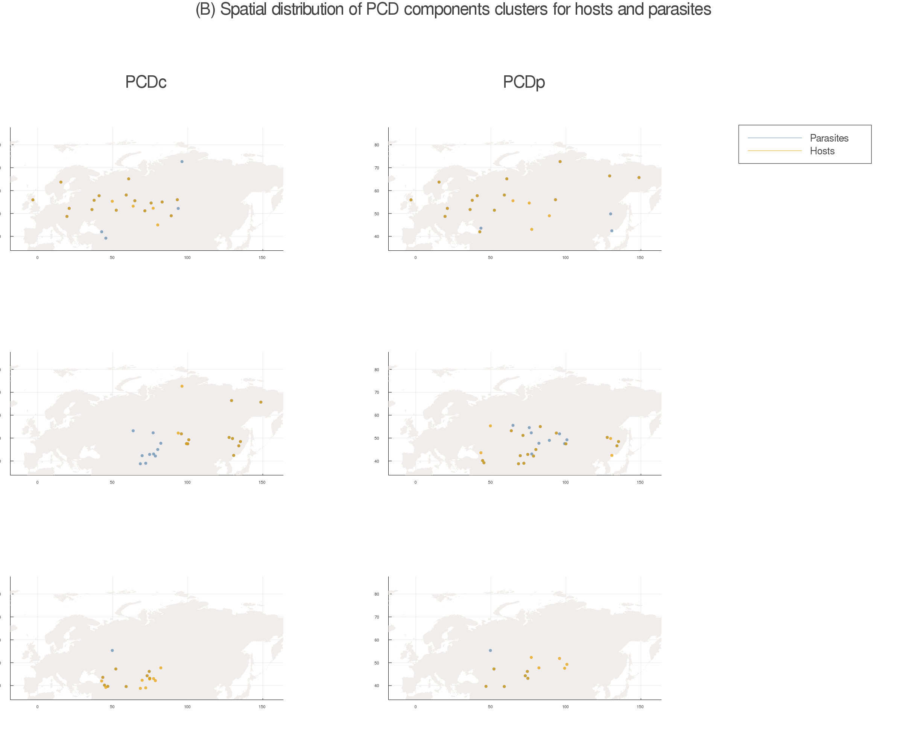

## Introduction

Ecological networks are complex units that incorporate many threads of the
fabric of biodiversity, namely species identity, interactions, and shared
coevolutionary history. Investigating the structure and the biogeography of
communities through species interactions can therefore be highly informative.
Local networks carry a record of both biogeographical and historical features of
the regional pool of species and interactions, as they are subsets of a regional
metaweb [@Holt2002FooWeb], and so result from the fact that species both
co-occur and interact. However, some of these characteristics can be lost over
time, in response to local ecological pressure or random change. This is notably
true of the co-phylogenetic signal of interactions [@Desdevises2015ComAna;
@Krasnov2015PhySig], which can be eroded by environmental filtering during
community assembly. This would result in a non-correlative variation of
ecological networks components [@Poisot2018IntRet; @Poisot2016StrPro].  

Dissimilarity of species interactions are always equal to, or greater than, the
differences in species composition, because there cannot be an interaction
without the presence of both partners. Therefore, interactions can be more
informative than the species richness or functional diversity alone
[@Poisot2017HosPar]. For instance, the probability of interaction may be
modified by environmental changes that affect the metabolic rate of organisms
[@Rall2012UniTem], by changes in their habitats [@Tylianakis2017EcoNet] or by
community's phylogenetic structure [@Coelho2017NeuBio] – which, in turn, varies
with the abundance and specialization of species involved [@Canard2014EmpEva;
@Tylianakis2017EcoNet], but is not captured by looking solely at species
composition.

Environmental conditions also have direct effects over species fitness. In this
sense, environmental gradients can change the frequency of interactions through
direct influence on species' characteristics and population abundance, which, on
the other hand, are also affected by interactions [@Poisot2014SpeWhy]. For
example, the environment can affect the production of
secondary metabolites that exert selective pressure on the organisms that
interact with certain plants [@Muola2010AssPla], how the geographical variation
of functional characteristics generates changes in the interaction network and
in species composition [@Konig2014ConRes; @CHAMuha2015EmpRes], as well as the
substitution of species along environmental gradients, variation in reproductive
success and in the trophic network, or, yet, how the population density
regulated by the environment can change the sign of an interaction
[@Bruder2017BioInt; @Doxford2013SpaTem; @Kaplan2005AphAlt].  

Because of all independent factors that can determine their occurrence, the
differences between communities related to interactions may be, but not
necessarily are, correspondent to those related to their species composition
[@Poisot2014SpeWhy], and therefore the indexes that measure characteristics of
ecological networks can also respond to environmental gradients in space and
time [@Dalsgaard2013HisCli; @Baiser2019EcoRul; @Gravel2019BriElt]. One of these
indexes that carries important historical information is the phylogenetic
diversity, measured as the sum of the lengths of the phylogeny branches that
include all the species that interact in a community. Dispersion and speciation
events are the main factors that affect the phylogenetic diversity of a network
of ecological interactions [@Coelho2017NeuBio; @Sebastian-Gonzalez2015MacTre;
@Trojelsgaard2013MacPol]. Moreover, phylogenetic diversity is very sensitive to
addition of species and may indicate, for example, the extent of impacts caused
by an invasive species in a community [@Davies2011PhyDiv]. Therefore, beta
diversity (the difference in the composition of communities) and the
phylogenetic diversity of interaction networks are related, and both can respond
to environmental variation in different ways.  

Based on a parasite-host system distributed over a vast biogeographic region
(Eurasia), we identified similar numerical and geographical clusters between the
phylogenetic diversity and the dissimilarity of species composition and
interactions of ecological networks. This result adds to our previous
understanding of biodiversity distribution and help us tell a more complete
story on the biogeography of ecological communities. Specifically, **add a
sentence about main findings**.

## Methods

We used the Hadfield et al. [-@Hadfield2014-tw] data on the parasitism
interaction between fleas and small mammals (Soricomorpha and Rodentia) in 51
regions of the Palearctic to investigate how beta-diversity of networks and
phylogenetic diversity are related. This publication gathers occurrence records
of 536,000 mammal individuals of 121 species, 1,692,000 individuals from 206
flea species that occurred in those mammals, and the interactions between them
[@Hadfield2013DatTal]. Original data is available at Data Dryad
(<http://dx.doi.org/10.5061/dryad.jf3tj>) and interaction data is available at
`mangal` database (<http://mangal.io>).  

The authors also used molecular and morphological traits of species to retrieve
the phylogenetic relationships between species. We used the resulting trees to
measure the phylogenetic community dissimilarity (PCD) of both hosts and
parasites metacommunities using the function `pcd` of the package `phyr`, in R
[@Li2020PhyRP; @RCoreTeam2018RLan]. To do that, we discarded sites with
no correspondents taxa in the phylogenetic trees.<!--only one site was
discarded: the network #22 had no correspondents on hosts tree--> The output of
the `pcd` function can be divided in compositional (PCDc) and phylogenetic
(PCDp) aspects of beta-diversity, which were summarized through a Principal
Component Analysis (PCA) and grouped by their own *k-means* for both parasites
and hosts.

Because of particular characteristics such as communities' species composition
and relationship with local environment, the differences in ecological networks
can be due to species turnover, links established by shared species or a
combination of both. In this sense, networks beta-diversity indexes are composed
by their characteristics on species composition and interactions both on local
and regional networks [@Poisot2012DisSpe]. Here we assessed three indexes that
summarize these information in different ways:  
1. *$\beta$s*: this index corresponds to the differences on species composition
between networks. A high $\beta$s means solely a high species turnover
[@Koleff2003MeaBet].  
2. *$\beta$os*: this index represents the differences on interactions between shared
species. It is the component of networks dissimilarity only related to
interactions, not species identity [@Canard2014EmpEva].  
3. *$\beta$wn*: this summarizes the global differences between all networks in a
metaweb, calculated as $\beta_wn = \beta_os + \beta_st$. It has two components:
the difference in interactions between shared species (*$\beta$os*) and the
difference in interactions due to species turnover *$\beta$st*. Therefore,
*$\beta$os* can not assume values higher than *$\beta$wn* [@Canard2014EmpEva].  

These measures were calculated using the `EcologicalNetworks.jl` and `Mangal.jl`
modules in Julia [@Poisot2020EcoNet; @Poisot2020EcoMan; @Bezanson2017JulFre] and
summarized with the `KGL11` function, which calculates the Sørensen index of
beta-diversity [@Koleff2003MeaBet]. *$\beta$s* was the only metric calculated
separately for hosts and parasites because it represents their taxonomic
diversities. The dissimilarity matrices resulting from this analysis
represented, therefore, the differences between networks considering each of the
indexes described above. In order to use these matrices on the following
analyses as a single variable, we performed a PCA on each matrix and selected
the first component of each. A subsequent PCA and *k-means* analysis on a
combined matrix of these variables allowed us to investigate how they co-vary
among networks.

## Results & Discussion

### Communities can be grouped according to network beta-diversity.  

The beta-diversity indexes described the dissimilarity of local networks in
different ways across the metacommunity. In our case these differences were very
prominent, making it possible to group communities by their interactions
dissimilarity decomposition.  

The first two axes of the Principal Component Analysis performed on the network
beta-diversity indexes, which explain 95.5% of the variation of the data,
separates the 50 networks (those with corresponding species in the phylogenetic
trees) in those that have more similar *$\beta$s*, *$\beta$os* and *$\beta$wn*
values ([@fig:one]). This separation is more explicit between *$\beta$s* and
*$\beta$wn*, and more diffuse for *$\beta$os*, which is aligned to the
assumption that *$\beta$s* and *$\beta$wn* are only indirectly related, while
*$\beta$os* have a more proximate relationship both with *$\beta$wn* and
*$\beta$s*. The fact that the networks grouped by *$\beta$s* values are so
different from those grouped by *$\beta$wn* may suggest that the turnover of
species in the first group causes loss of links through loss of co-occurrence,
while in the former group this turnover is translated into new connections. The
_$\beta$os_ group, however, would be composed by communities that change less in
species composition, but more in ecological interactions.  

Because *$\beta$s* and the species composition of the phylogenetic community
dissimilarity (PCDc) can be interpreted in the same way, a Principal Component
Analysis of PCDc would provide a closer look to the *$\beta$s* metric. Our
results suggest that, from a species composition point of view, parasites
communities are much more similar across the metaweb than hosts, that can be
more easily described in three main groups ([@fig:one] D and [@fig:one] E,
respectively). The diversity of fleas can be much more uniform in space because
it is common that a single host interacts with more than one species of
parasites. In this particular case, only a few fleas communities have a
distinguished species composition and can be grouped together.  

On the other hand, the three groups of the phylogenetic component of PCD (PCDp)
for both hosts and parasites are distinct: the diffuse group that appears in
parasites' PCDc does not repeat on PCDp. Additionally, both clades are arranged
similarly in the Principal Components space, with groups 2 and 3 being more
alike than group 1. This may be a reflex of the biogeographic history of
communities, where one group is ancestral to the other two.   

![Principal Component Analysis of networks beta-diversity metrics and
projection of local networks. For the dataset used here, networks are clearly
described by three dimensions of beta-diversity: while *$\beta$s* captures part of the
variation that is complementary to that captured by *$\beta$wn*, *$\beta$os* describes a
completely different dimension of the data. (A) PCA of networks beta-diversity
metrics _$\beta$s_, _$\beta$wn_ and _$\beta$os_; PCA of the phylogenetic component of PCD (PCDp)
for parasites (B) and hosts (C); PCA of the compositional component of PCD (PCDc)
for parasites (D) and hosts (E).](figures/fig1.png){#fig:one}  

### Each beta-diversity index relates in a particular way with phylogenetically community dissimilarity (PCD).  

As expected, _$\beta$s_ and PCDc are proxies for each other both for hosts and
parasites, while PCDc is inversely correlated with _$\beta$wn_ ([@fig:twoA]).
Communities with a high _$\beta$s_ value are very different from those around them,
and the change in species composition could also represent a shift in the links
inside these networks either because new species will probably explore
different ranges of ecological niche or because the loss of species would also
represent a loss of interaction. These changes in links inside networks are
represented by _$\beta$os_, and its relationship with both PCDc and PCDp is highly
variable ([@fig:twoB] and [@fig:threeB]).  

Because any change in species composition highly affects phylogenetic diversity,
_$\beta$s_ is also positively correlated with PCDp ([@fig:twoB]). Communities with high
values for any of those metrics are located in regions with expected higher
biodiversity ([@fig:threeA] and [@fig:threeB]), and this may indicate that the
biogeographical history of these communities are more related to migration than
diversification of local lineages [@Davies2011PhyDiv]. Therefore, networks with
high PCDp also represent communities with lower ecological redundancy and higher
functional diversity because it indicates that the species turnover is happening
between species phylogenetically distant.

On the other hand, networks that are better represented by *$\beta$wn* - i.e., those
which differences between them are significantly smaller than the differences in
relation to the metaweb - are also phylogenetically similar, varying always
inside a limited range of small dissimilarity (both with PCDc and PCDp). Because
these communities also have low values of *$\beta$s*, indicating less frequent species
turnover, this dissimilarity is due to different links between shared species.
This result may reflect two possible scenarios:  
1. In similar communities with low phylogenetic diversity (shorter branch
lengths) the turnover of species could be adding very ecologically similar
lineages, which leads to different interactions to prevent local extinction
through competition.  
2. In similar communities with high phylogenetic diversity (longer branch
lengths) the species turnover may have been a result of invasion and migration,
which may lead to opportunistic interactions.  

This is also illustrated in [@fig:twoA] and [@fig:twoB] on scatterplots of
*$\beta$os* vs. PCD: networks that differ little in phylogenies have a broader
range of values of *$\beta$os*, while highly phylogenetically distinct newtorks
only have very low values of *$\beta$os* - meaning that, for communities with
high values of PCD, the few species that are shared interact in the same way.
Additionally, because those same communities also have low values of *$\beta$wn*
(i.e., they are very similar to the overall metaweb) and high values of
*$\beta$s* (i.e., high species turnover), the interactions are probably being
conserved also when species are replaced, like when two species that are
phylogenetically distant replace each other in the same ecological function.

{#fig:twoA}  

![Effects of the phylogenetic component of the phylogenetic diversity dissimilarity on network beta-diversity for both parasites (left) and hosts (right). The colours correspond to the groups described on fig. 1. Networks with higher values of PCDp are phylogenetically more distinct, and therefore have lower values of *$\beta$os* (because they do not share many species). Networks better represented by *$\beta$wn* and *$\beta$os* are less distinguished on this aspect, but usually have lower values of PCDp.](figures/fig2B.png){#fig:twoB}  

### The separation of communities by components of beta-diversity was also observed geographically  

There is a gradual transition between networks that were better described
by turnover of species, clustered in central south Eurasia, to those more unique
compared to the metaweb, spread in the north ([@fig:threeA]). The regional species
pool is expected to be more diverse towards the tropics, and therefore local
networks have a higher chance to have different species composition, which
results in a strong contribution of *$\beta$s* for networks beta-diversity. Because of
the high diversity, species are functionally "packed", and although some species
could have more generalist interactions, they would rarely do so, in order to
avoid competition. Heading north, species turnover would be less frequent due to
a decrease in regional species richness, and now networks have more shared
species. They start to "unpack" and establish interactions with other remaining
species, and therefore the *$\beta$os* component of beta-diversity explains better why
networks are different. The third group of networks, characterized by a high
value of *$\beta$wn*, is also composed by phylogenetically similar communities (as
seen in [@fig:twoB]). Because the species richness is even lower, any change in
composition can have a high impact on interactions. Therefore, the *$\beta$os*
component is still very important, but now differences in interactions due to
species turnover contribute much more to networks' beta-diversity.

The phylogenetic community dissimilarity of networks was also geographically
grouped, and in the region where *$\beta$s* was more important, there was a very
distinguished group for both fleas' and mammals' phylogenetic dissimilarity
([@fig:threeB]). The two other groups are differently arranged in space: PCDc
groups have a similar latitudinal distribution, but different longitudinal
ranges, while PCDp groups are the opposite. This distribution of phylogenetic
groups highlight the uniqueness of the southern-central set of communities,
which suggests historical isolation of species. Additionally, the purely
phylogenetic component of PCD reinforces the geographic distribution of
beta-diversity metrics as seen in [@fig:threeA], with one group largely spread in
the north - occupying a diverse range of environments - and two other groups
restricted to latitudes under 60° ([@fig:threeB]).

{#fig:threeA}  

{#fig:threeB}  

## Conclusion  

The conspicuous association - both numerical and geographical - between the
evolutionary history of species and networks' beta-diversity properties
clarifies key aspects of the biogeography of hosts and parasites communities in
Eurasia. For example, the longitudinal PCDc clusters separation roughly coincide
with the presence of the Ural Mountains. From this point of view, considering
the longitudinal spread of PCDp, the history of both hosts and parasites seems
to have a clear path of migration and diversification from south-central Eurasia
towards the north. This history is also sustained by the metaweb beta-diversity
metrics: with a distinctive *$\beta$s* group at the south of the Ural Mountains
suggesting higher species richness and common origin, followed towards north by
gradual changes in interactions and composition, they sum up to the information
unveiled by PCDp to describe a very likely biogeographic history.  By describing
how the phylogeetic differences between networks vary in the same way within
groups, this result seems to reinforce previous findings that there is no
co-phylogenetic matching between regional and local networks
[@Poisot2018IntRet]. If networks co-varied in continental scale in the same way
they co-vary in local scale, our analyses would not detect the groups
illustrated in [@fig:threeB].

Finally, this paper highlights how beta-diversity and phylogenetic dissimilarity
are related to each other, and sheds light on the possibility that they interact
with the environment in different ways. While *$\beta$s* seems to be connected
to environmental uniqueness and geographical barriers, *$\beta$os* and
*$\beta$wn* better reflect migration processes and evolutive trajectories. As
stated at the beginning of this text, ecological networks are valuable,
multidimensional lenses through which we can investigate biodiversity and its
history. Although we did not account for properties such as phenology and
natural history aspects of species, we did find that small scale processes such
as species interactions can be integrated in large scale investigations and can
have a stamp in macroecological processes.

Interaction networks between parasites and hosts have great potential to be used
as study systems in the geographic variation of interactions [@Proulx2005NetThi; @Poulin2010NetAna]. Because of the
particular type of association between parasites and hosts, the dissimilarity of
these interactions networks reflect not only the environmental differences, but
also the replacement of the host species [@Eriksson2019HosEnv;
@Krasnov2005SpaVar; @Poulin2010SimVar]. Nevertheless, the association between
parasites and hosts is often the result of the evolutionary history of the
groups, and this history can result in a non-neutral contribution of these
species to the beta diversity of these communities [@Poisot2012DisSpe]. The
underlying logic of our approach pertains to a wide diversity of systems; not
only do rodents act as reservoirs for zoonotic diseases, -@Albery2020PreGlo show that
understanding the global-scale structure of host-virus interactions *requires* a
joint understanding of the geographical and evolutionary mechanisms involved in
shaping them. We argue that when the data are available, there is even more
information to be gained by looking at the way interactions vary.

## References
